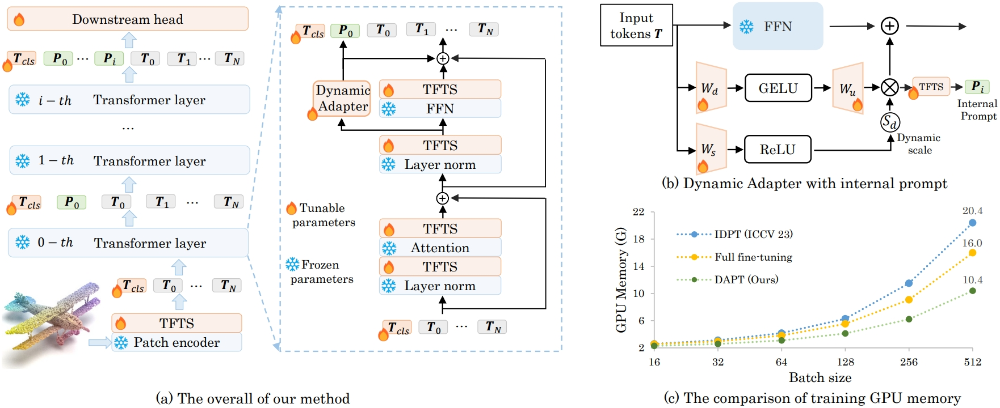

<div align="center">
<h1>Dynamic Adapter Meets Prompt Tuning: <br>
Parameter-Efficient Transfer Learning for Point Cloud Analysis</h1>


[Xin Zhou](https://lmd0311.github.io/)<sup>1</sup>\* , [Dingkang Liang](https://dk-liang.github.io/)<sup>1</sup>\* , [Wei Xu](https://scholar.google.com/citations?user=oMvFn0wAAAAJ&hl=en)<sup>1</sup>, [Xingkui Zhu](https://scholar.google.com/citations?user=wKKiNQkAAAAJ&hl=en)<sup>1</sup> ,[Yihan Xu](https://github.com/yhxu022)<sup>1</sup>, [Zhikang Zou](https://bigteacher-777.github.io/)<sup>2</sup>, and [Xiang Bai](https://scholar.google.com/citations?user=UeltiQ4AAAAJ&hl=en)<sup> 1✉️</sup>

<sup>1</sup>  Huazhong University of Science & Technology, <sup>2</sup>  Baidu Inc.

(*) equal contribution, (​✉️​) corresponding author.

[](https://arxiv.org/abs/2403.01439)
[](https://zhuanlan.zhihu.com/p/686850575)
[](https://hits.seeyoufarm.com)
[](https://github.com/LMD0311/DAPT/issues?q=is%3Aopen+is%3Aissue)
[](https://github.com/LMD0311/DAPT/issues?q=is%3Aissue+is%3Aclosed) 
[](https://github.com/tatsu-lab/stanford_alpaca/blob/main/LICENSE)

</div>

## 📣 News

- **[11/Oct/2024]** 🚀 Check out our latest efficient fine-tuning work **[PointGST](https://github.com/jerryfeng2003/PointGST)** which achieves **99.48%**, **97.76%**, and **96.18%** overall accuracy on the ScanObjNN OBJ_BG, OBJ_OBLY, and PB_T50_RS datasets, respectively.
- **[02/Mar/2024]** ✨ Release the code and checkpoint. 😊😊
- **[26/Feb/2024]** 🎉 Our paper DAPT is accepted by **CVPR 2024**! 🥳🥳

## Abstract

Point cloud analysis has achieved outstanding performance by transferring point cloud pre-trained models. However, existing methods for model adaptation usually update all model parameters, i.e., full fine-tuning paradigm, which is inefficient as it relies on high computational costs (e.g., training GPU memory) and massive storage space. In this paper, we aim to study parameter-efficient transfer learning for point cloud analysis with an ideal trade-off between task performance and parameter efficiency. To achieve this goal, we first freeze the parameters of the default pre-trained models and then propose the Dynamic Adapter, which generates a dynamic scale for each point token, considering the token significance to the downstream task. We further seamlessly integrate **D**ynamic **A**dapter with **P**rompt **T**uning (DAPT) by constructing Internal Prompts, capturing the instance-specific features for interaction. Extensive experiments conducted on five challenging datasets demonstrate that the proposed DAPT achieves superior performance compared to the full fine-tuning counterparts while significantly reducing the trainable parameters and training GPU memory by 95% and 35%, respectively.

## Overview

<div  align="center">    
 
</div>


## Getting Started

### Installation

We recommend using Anaconda for the installation process:
```shell
$ git clone https://github.com/LMD0311/DAPT.git
$ cd DAPT
# Create virtual env and install PyTorch
$ conda create -y -n dapt python=3.9
$ conda activate dapt
(dapt) $ pip install torch==1.8.0+cu111 torchvision==0.9.0+cu111 torchaudio==0.8.0 -f https://download.pytorch.org/whl/torch_stable.html

# Install basic required packages
(dapt) $ pip install -r requirements.txt

# Chamfer Distance & emd
(dapt) $ cd ./extensions/chamfer_dist && python setup.py install --user
(dapt) $ cd ../..
(dapt) $ cd ./extensions/emd && python setup.py install --user

# PointNet++
(dapt) $ pip install "git+https://github.com/erikwijmans/Pointnet2_PyTorch.git#egg=pointnet2_ops&subdirectory=pointnet2_ops_lib"

# GPU kNN
(dapt) $ pip install --upgrade https://github.com/unlimblue/KNN_CUDA/releases/download/0.2/KNN_CUDA-0.2-py3-none-any.whl
```

### Datasets

See [DATASET.md](./DATASET.md) for details.

### Pretrain

To fine-tune on downstream tasks, you may need to download or reproduce the pre-trained checkpoint.

## Main Results (Point-MAE)


| Task           | Dataset      | Trainable Parameters | Config                                                       | Acc.   |                     Checkpoints Download                     | logs                                                         |
| :------------- | :----------- | :------------------: | :----------------------------------------------------------- | :----- | :----------------------------------------------------------: | ------------------------------------------------------------ |
| Classification | ScanObjectNN |         1.1M         | [finetune_scan_objbg_dapt.yaml](./cfgs/finetune_scan_objbg_dapt.yaml) | 90.88% | [OBJ-BG](https://github.com/LMD0311/DAPT/releases/download/ckpt/scan_objbg.pth) | [scan_objbg.log](https://github.com/LMD0311/DAPT/releases/download/ckpt/scan_objbg.log) |
| Classification | ScanObjectNN |         1.1M         | [finetune_scan_objonly_dapt.yaml](./cfgs/finetune_scan_objonly_dapt.yaml) | 90.19% | [OBJ-ONLY](https://github.com/LMD0311/DAPT/releases/download/ckpt/scan_objonly.pth) | [scan_objonly.log](https://github.com/LMD0311/DAPT/releases/download/ckpt/scan_objonly.log) |
| Classification | ScanObjectNN |         1.1M         | [finetune_scan_hardest_dapt.yaml](./cfgs/finetune_scan_hardest_dapt.yaml) | 85.08% | [PB-T50-RS](https://github.com/LMD0311/DAPT/releases/download/ckpt/scan_hardest.pth) | [scan_hardest.log](https://github.com/LMD0311/DAPT/releases/download/ckpt/scan_hardest.log) |
| Classification | ModelNet40   |         1.1M         | [finetune_modelnet_dapt.yaml](./cfgs/finetune_modelnet_dapt.yaml) | 93.5%  | [ModelNet-1k](https://github.com/LMD0311/DAPT/releases/download/ckpt/modelnet.pth) | [modelnet.log](https://github.com/LMD0311/DAPT/releases/download/ckpt/modelnet.log) |


The evaluation commands with checkpoints should be in the following format:
```shell
CUDA_VISIBLE_DEVICES=<GPU> python main.py --test --config <yaml_file_name> --exp_name <output_file_name> --ckpts <path/to/ckpt>
```

## Fine-tuning on downstream tasks

###  ModelNet40

```shell
CUDA_VISIBLE_DEVICES=<GPU> python main.py --config cfgs/finetune_modelnet_dapt.yaml --ckpts <path/to/pre-trained/model> --finetune_model --exp_name <name>

# further enable voting mechanism
CUDA_VISIBLE_DEVICES=<GPU> python main.py --config cfgs/finetune_modelnet_dapt.yaml --test --vote --exp_name <name> --ckpts <path/to/best/model>
```

The voting strategy is time-consuming and unfair for various compute platforms; hence, we prioritize reporting overall accuracy without voting. We recommend not to use the voting strategy, despite the promising results. 🙏🙏

### ScanObjectNN

```shell
# For fine-tuning on OBJ-BG variant
CUDA_VISIBLE_DEVICES=<GPU> python main.py --config cfgs/finetune_scan_objbg_dapt.yaml --ckpts <path/to/pre-trained/model> --finetune_model --exp_name <name>

# For fine-tuning on OBJ-ONLY variant
CUDA_VISIBLE_DEVICES=<GPU> python main.py --config cfgs/finetune_scan_objonly_dapt.yaml --ckpts <path/to/pre-trained/model> --finetune_model --exp_name <name>

# For fine-tuning on PB-T50-RS variant
CUDA_VISIBLE_DEVICES=<GPU> python main.py --config cfgs/finetune_scan_hardest_dapt.yaml --ckpts <path/to/pre-trained/model> --finetune_model --exp_name <name>
```

## t-SNE visualization

You can use t-SNE to visualize the results obtained on ScanObjectNN test sets.


```shell
# t-SNE on ScanObjectNN
CUDA_VISIBLE_DEVICES=<GPU> python main.py --config cfgs/tsne/finetune_scan_hardest_dapt_tsne.yaml --ckpts <path/to/ckpt> --tsne --exp_name <name>
```
You can also make your own config for other visualization. 😍😍

## Acknowledgements

This project is based on Point-BERT ([paper](https://arxiv.org/abs/2111.14819), [code](https://github.com/lulutang0608/Point-BERT)), Point-MAE ([paper](https://arxiv.org/abs/2203.06604), [code](https://github.com/Pang-Yatian/Point-MAE)), ACT([paper](https://arxiv.org/abs/2212.08320), [code](https://github.com/RunpeiDong/ACT)), ReCon ([paper](https://arxiv.org/abs/2302.02318), [code](https://github.com/qizekun/ReCon)), IDPT ([paper](https://arxiv.org/abs/2304.07221), [code](https://github.com/zyh16143998882/ICCV23-IDPT)). Thanks for their wonderful works.


## Citation

If you find this repository useful in your research, please consider giving a star ⭐ and a citation
```bibtex
@inproceedings{zhou2024dynamic,
  title={Dynamic Adapter Meets Prompt Tuning: Parameter-Efficient Transfer Learning for Point Cloud Analysis},
  author={Zhou, Xin and Liang, Dingkang and Xu, Wei and Zhu, Xingkui and Xu, Yihan and Zou, Zhikang and Bai, Xiang},
  booktitle={Proceedings of the IEEE/CVF Conference on Computer Vision and Pattern Recognition},
  pages={14707--14717},
  year={2024}
}
```